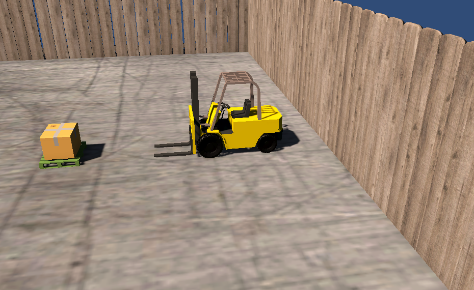

<h1>Simulador de empilhadeira em Unity</h1>

Projeto de simulação de empilhadeira com Unity e C#

# Sobre

Este é um projeto game engine de simulação de empilhadeira em Unity e C# 

# Tecnologias

Foi usado na construção do projeto:

- [Unity](https://unity.com/pt)

# Pre-requisitos

Ter instalado em sua máquina as seguintes ferramentas:

•  Editor de Trabalho: Microsoft Visual Studio 

•  Ferramenta para rodar o aplicativo: Unity Hub

# Resultado

<h1 align="center">
  
</h1>
